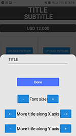
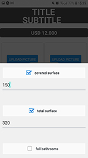

# RealtorAssistant
### LinkedIn: https://www.linkedin.com/in/fred-prat/

This is an app I've made for my brother who is a real estate agent. He once said to me he did not have a way to easily make photo compilations to upload to his instagram
stories and whatsapp status to advertise the houses. So I thought it would be a good idea to make an app for that purpose.
 
  
 
  I used the following libraries and technologies to develop it:  
    - Expo as the main platform and framework to build it  
    - TypeScript  
    - ImagePicker to administrate permissions and image upload to the app  
    - React Native Elements to get a hand with checkboxes and inputs  
    - Keyboard Aware Scroll View to help with keyboard behavior   
    - React native safe area context to avoid the problematic differences between the top side screen of each device   
    - React redux to manage the global state  
    - React Native Navigate to navigate between elements and screens  
     
     
    Here you have the Expo QR Code to try the app yourself. You have to download ExpoGo app and scan that code to open my app ready to be used 
    
     
     
    
    This is the Home Screen where you can edit everything to your liking  
    
    If you tap the title or subtitle a modal will pop up to offer you different configuration options  
    
    If you tap on the middle white center a modal will pop up with checkboxes, you can check all the options you
   want to show  
    
    This is how it looks after you set everything up. It has the 1080x1920 size recommended for instagram stories and Whatsapp Status.  
       Ivan Prat is my brother by the way haha
